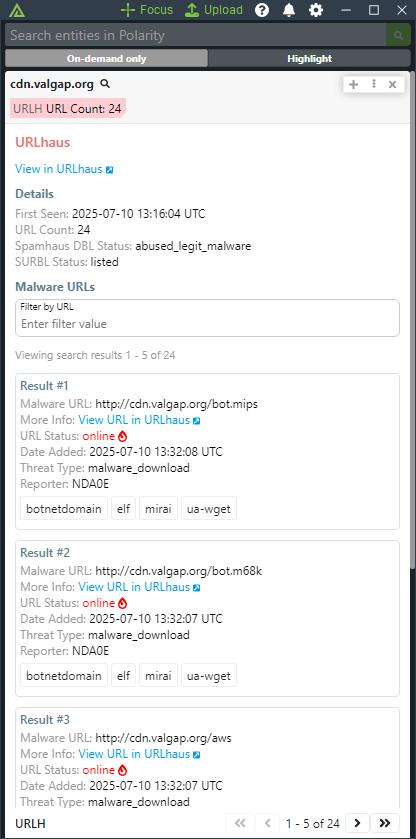

# Polarity URLhaus Integration

The Polarity URLhaus integration takes indicators on your screen and overlays if there are any malicious URLs associated with that indicator.

To learn more information about URLhaus, please go to: https://urlhaus.abuse.ch

Check out the integration in action below:

### URLhaus URL
The base URL to use for the URLhaus API

### URLhaus Auth Key
Your URLhaus Auth Key. See https://urlhaus-api.abuse.ch/#auth_key for information on obtaining a key.

### Minimum URL Count
Minimum count of urls to be notified on from URLhaus

### Domain and IP Blacklist

This is an alternate option that can be used to specify domains or IPs that you do not want sent to URLHaus.  The data must specify the entire IP or domain to be blocked (e.g., www.google.com is treated differently than google.com).

### Ignored Domain Regex

This option allows you to specify a regex to set domains.  Any domain matching the regex will not be looked up.

### Ignored IP Regex

This option allows you to specify a regex to set IPv4 Addresses.  Any IPv4 matching the regex will not be looked up.

## Installation Instructions

Installation instructions for integrations are provided on the [PolarityIO GitHub Page](https://polarityio.github.io/).

## Max Concurrent Search Requests

Maximum number of concurrent search requests (defaults to 20). Integration must be restarted after changing this option.
## Minimum Time Between Searches

Minimum amount of time in milliseconds between each entity search (defaults to 100). Integration must be restarted after changing this option.

## Polarity

Polarity is a memory-augmentation platform that improves and accelerates analyst decision making.  For more information about the Polarity platform please see:

https://polarity.io/
